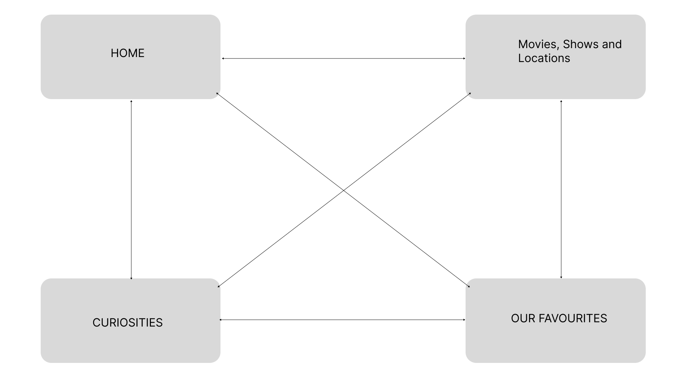

# C2: User Interface - Information Architecture, Navigation, Layout

## Information Organization
Our website follows a mobile-first responsive design approach. The information is organized as follows:

### Mobile Layout (320px - 768px)
- Single column layout
- Collapsible hamburger menu
- Stacked content cards
- Full-width images
- Vertical scrolling for all content sections
- Bottom navigation for key actions

### Tablet/Desktop Adaptations (>768px)
- Multi-column grid layout
- Horizontal navigation menu
- Side-by-side content display
- Optimized image galleries
- Enhanced interactive elements

## Interface and Common Features

### Sketches

| Homepage Mobile Sketch | 
|:-------------------:|
|  | 
| Initial mobile homepage design showing hamburger menu, hero section, and stacked content cards | 
### Wireframes

| Desktop Layout | 
|:-------------:|
|  | 
| Desktop version with expanded navigation, multi-column layout, and enhanced interactive features | 
## Sitemap

| Main Navigation Structure |
|:-----------------------:|
|  | 
| Overview of primary navigation showing the hierarchical structure of main sections | 

The sitemap illustrates the four main sections of our website:
1. **Home** - Introduction to film tourism and featured content
2. **Movies & Locations** - Searchable database of filming locations
3. **Curiosities** - Behind-the-scenes information and facts
4. **Our Favourites** - Highlighted locations and recommendations

Each section is designed to be easily accessible regardless of device size, with navigation patterns optimized for both touch and cursor interactions.

Note: The images referenced in this document need to be created and added to the project's image directory structure.
