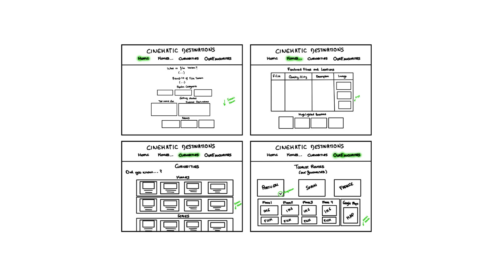
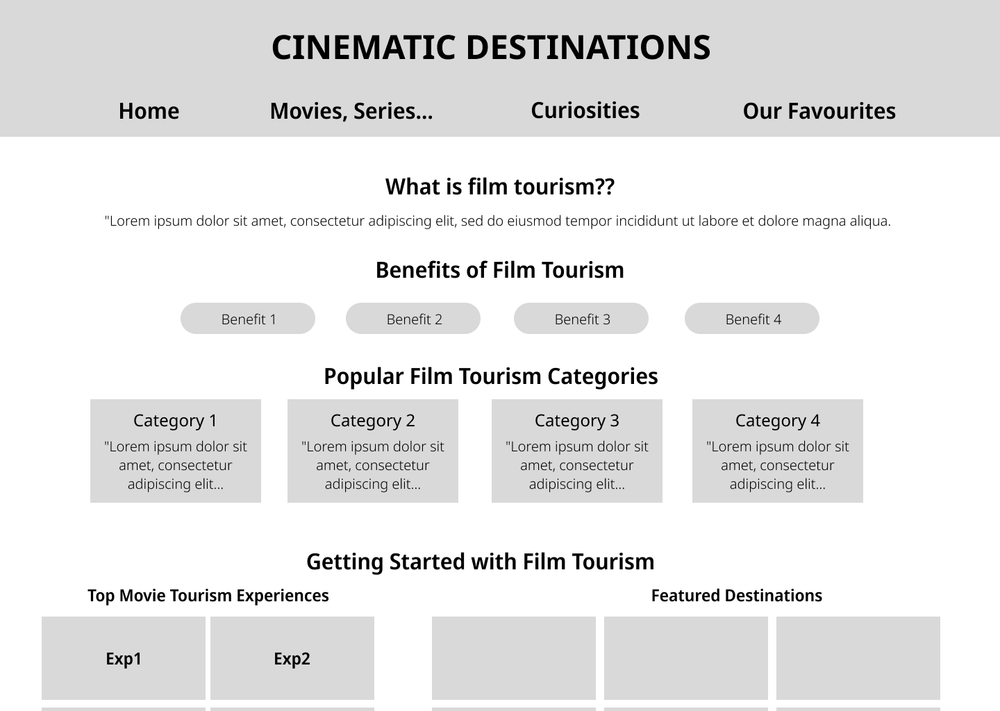
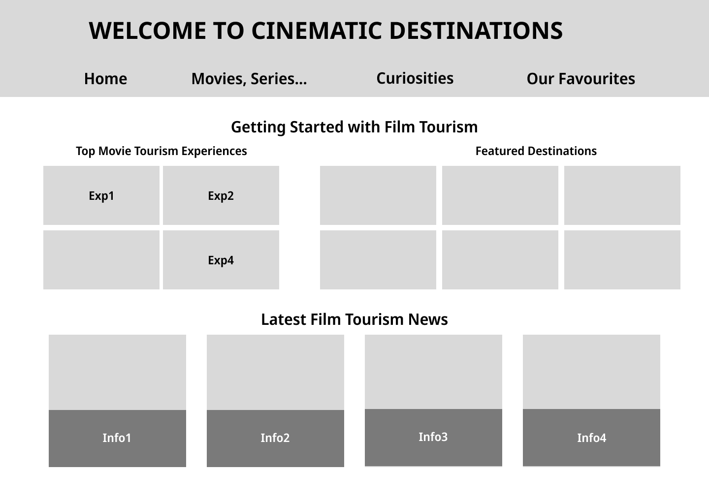
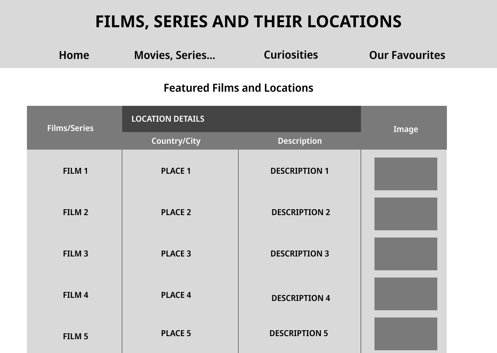
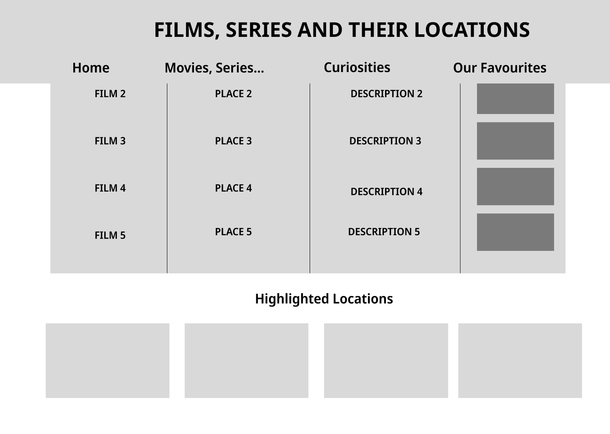
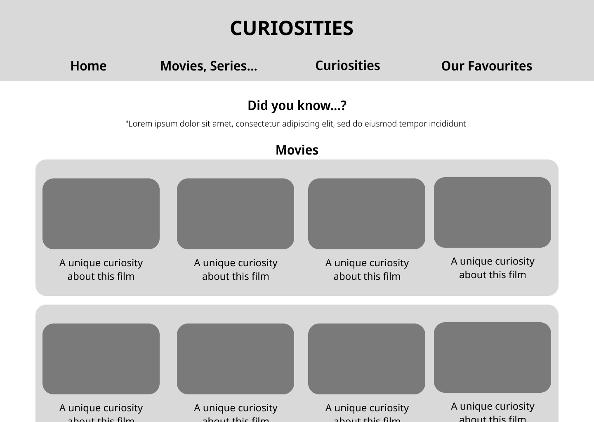
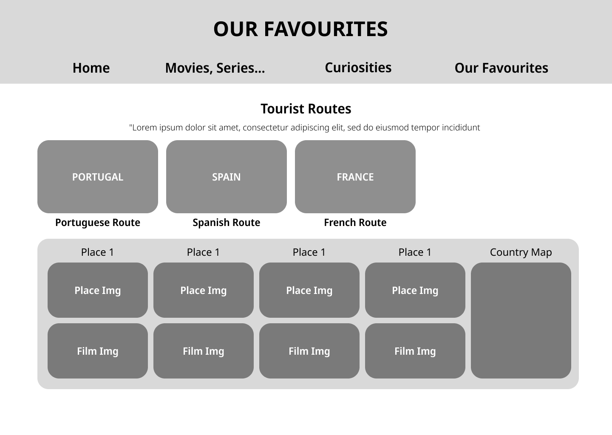

# C2: User Interface - Information Architecture, Navigation, Layout

## Information Organization
Our website follows a mobile-first responsive design approach. The information is organized as follows:

### Mobile Layout (320px - 768px)
- Single column layout
- Stacked content cards
- Full-width images

###Desktop Adaptations (>768px)
- Multi-column grid layout
- Horizontal navigation menu
- Side-by-side content display
- Responsive image grid galleries

## Interface and Common Features

### Sketches

|Sketch |
|:-------------------:|
|  |
| Initial sketch showing side navigation panel, content area, and interactive elements |

### Wireframes

### Desktop Layout

| Page | Preview |
|:-----|:--------|
| Home |  |
| Home Slide |  |
| Films |  |
| Films Slide |  |
| Curiosities |  |
| Our Favourites |  |

Each layout showcases the responsive design and interactive features specific to that section.

## Sitemap

| Main Navigation Structure |
|:-----------------------:|
|  | 
| Overview of primary navigation showing the hierarchical structure of main sections | 

The sitemap illustrates the four main sections of our website:
1. **Home** - Introduction to film tourism and featured content
2. **Movies & Locations** - Searchable database of filming locations
3. **Curiosities** - Behind-the-scenes information, filming routes, and cultural facts
4. **Our Favourites** - Curated recommendations and personal highlights

Each section features:
- Responsive grid layouts
- Interactive elements
- Dynamic content loading
- Optimized image displays

